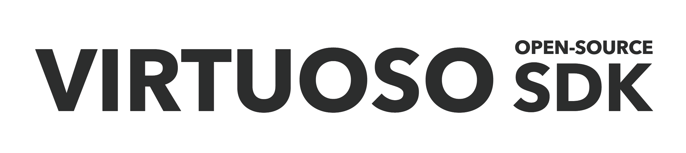

# VSDK Unreal Edition

The road to developing XR content is full of obstacles. VSDK was made by XR developers for XR developers, to remove some of those obstacles so you can focus on building immersive, interactive experiences.

*VSDK is now available for the Unreal Engine.* 

While VSDK Unreal should be compatible with previous versions of Unreal Engine, use with Unreal Engine 4.26 for best results. See the [GitHub wiki](https://github.com/charles-river-analytics/VSDK-Unreal/wiki) for installation instructions. Additional documentation and tutorials will be available soon.

## Disclaimer

VSDK Unreal is currently in **alpha**, which means it is functional but not guaranteed to be stable. Code is likely to evolve as we move towards a **beta** release, when the code will be stable but not 100% bug-free.

## Features
VSDK Unreal incorporates the same time-saving features as the original [VSDK for Unity 3D](https://github.com/charles-river-analytics/VSDK-Unity):
- Multiplatform Support
  - Develop your experience once in Unreal Engine and easily deploy it to common XR devices without significant rework.
  - The device roadmap includes less common I/O technologies, such as hand tracking, eye tracking, and haptics, because we believe future XR platforms will rely on these technologies.
- Blueprint Ready
  - Blueprint Scripting is one of the coolest features of Unreal Engine.
  - Most code for VSDK Unreal is written in C++, but VSDK Unreal is completely usable and extensible via Blueprint.
- Interaction System
  - Our interaction system includes the most common XR use cases, with a focus on immersive simulations.
  - The system includes locomotion, object interaction, and more!
